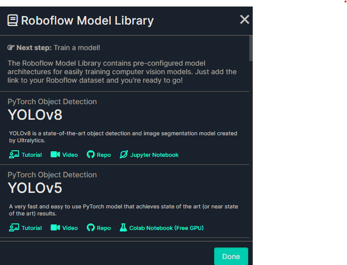

# Dataset Sources for the Model

Most of the models choosen and used are sources from acedemic and open-source distributions

## Datasets
* JAFFE 
* PIE 
* MMI 
* BU-3DFE 
* CK+ 
* FER 
* CAFE 
* SFEW 
* RAF-DB 


https://www.cs.cmu.edu/afs/cs/project/PIE/MultiPie/Multi-Pie/Content.html

https://www.kaggle.com/datasets/msambare/fer2013?resource=download

```bash
kaggle competitions download -c challenges-in-representation-learning-facial-expression-recognition-challenge
```
   
http://www.whdeng.cn/raf/model1.html  -- mail request sent


1. https://universe.roboflow.com/national-kaohsiung-university-of-science-and-technology-i3169/baby_detection-butde  --- Model

*   https://universe.roboflow.com/national-kaohsiung-university-of-science-and-technology-i3169/baby_detection-butde/dataset/5  -- Dowloaded - TF version

2. https://universe.roboflow.com/object-detection-8gcrk/kids-detector

* https://universe.roboflow.com/object-detection-8gcrk/kids-detector/dataset/3

3. 